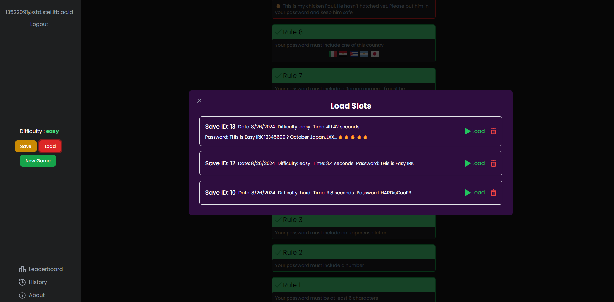

<!-- Back to Top Link-->

<a name="readme-top"></a>

<br />
<div align="center">
  <h1 align="center">Password Game</h1>

  <p align="center">
    <h4> Password Game Web Application using react tailwind and golang</h4>
    <br/>
    <a href="https://github.com/NoHaitch/Password-Game/issues">Report Bug</a>
    ·
    <a href="https://github.com/NoHaitch/Password-Game/issues">Request Feature</a>
<br>
<br>

[![MIT License][license-shield]][license-url]

  </p>
</div>

<!-- CONTRIBUTOR -->
<div align="center" id="contributor">
  <strong>
    <h3>Made By:</h3>
    <h3>Raden Francisco Trianto Bratadiningrat</h3>
    <h3>13522091</h3>
  </strong>
  <br>
</div>

<!-- TABLE OF CONTENTS -->
<details>
  <summary>Table of Contents</summary>
  <ol>
    <li>
      <a href="#about-the-project">About The Project</a>
    </li>
    <li>
      <a href="#getting-started">Getting Started</a>
      <ul>
        <li><a href="#prerequisites">Prerequisites</a></li>
        <li><a href="#installation">Installation</a></li>
        <li><a href="#instruction">Instruction</a></li>
        <li>
        <details>
          <summary><a href="#features">Features</a></summary>
          <ol>
            <li><a href="#1-feature-x">Features - 1</a></li>
            <li><a href="#2-feature-y">Features - 2</a></li>
            <li><a href="#3-feature-z">Features - 3</a></li>
          <ol>
        </details>
        </li>
      </ul>
    </li>
    <li><a href="#contributing">Contributing</a></li>
    <li><a href="#license">License</a></li>
    <li><a href="#special-thanks">Special Thanks</a></li>
  </ol>
</details>

<p align="right">(<a href="#readme-top">back to top</a>)</p>

<!-- ABOUT THE PROJECT -->

## About The Project

Inspired by the original [password game](https://neal.fun/password-game/).

Password game is a game where the user make a password that must fufill many rules as challenges.
The goal is to create a password good enough that it fufill all rules within a short amount time.

This project re-creates the password game with my own twist and other feature other than the game.
Some of those features are: save and load game, cheat, history, and global leaderboard. From this project I am able to learn many things like authentication and maintaining an efficient api to be able to keep up with the frontend.

<p align="right">(<a href="#readme-top">back to top</a>)</p>

## Technology Used

- Frontend: React + tailwind
- Backend : Golang with Gin Framework and sqlite3
- Authentication : Firebase

_Note: Database is stored in a local database due to the limited time to learn firebase data storage_

<p align="right">(<a href="#readme-top">back to top</a>)</p>

## Program Structure

Source code is stored in src folder with the folder structure:

```
/src
├──/backend
    ├──/algorithms
        ├── aho-corasick.go
        ├── BM.go
        └── regex.go
    ├──/rules
        ├── cheat.go
        ├── rule.go
        ├── rule1.go
        ├── rule2.go
        ├── ...
        └── rule20.go
    ├──database.go
    └──main.go
└── /frontend
    └── # normal react folder structure
```

Explanation:

- `backend` -- stores all the backend coode
- `frontend` -- stores all the frontend coode
- `main.go` -- API
- `database.go` -- Database using sqlite3
- `BM.go` -- Boyer-Moore algorithm implementation
- `regex.go` -- Regex
- `aho-corasick.go` -- Aho-Corasick algorithm implementation
- `cheat.go` -- Impelement the cheat command
- `rule.go` -- Combine all the rules
- `ruleX.go` -- X means the rule number

main backend functions:

- `CheatSolution` : call the cheat command to solve the password for the rules
- `TestPassword` : Test the password to check if all rules is satisfied

<p align="right">(<a href="#readme-top">back to top</a>)</p>

<!-- FEATURES -->

## Features

### 1. Password Game with 20 rules

### 2. Cheat command (type "cheat" to the password field)

### 3. Algorithms Used: BM, Regex, and Aho-corasick
#### 1) BM: text finding algorithm
- Boyer Moore is a pattern finding algorithm that uses bad character heurstic to efficiently do string matching but only for one pattern
- Used in: Majority of checking if a pattern is in the password

#### 2) Regex: extract pattern from text
- Regex (Regular Expression) to extract patterns from text
- Used in: Extracting numbers and Extracting roman numerals in the password
  
#### 3) Aho-corasick: text finding algorithm
- Aho-corasick is a pattern finding algorithm that uses a data strcut similar to a trie
- Has linier complexity for checking many patterns at combined
- Used in: Checking if one of many patterns is contained in the password 


### 4. Leaderboard

### 5. History

### 6. Save and Load Game

## Pages

<div align="center" >
    
    <p><strong>Home Page</strong></p>
    <p>User can login or register using email or google</p>
</div>
<br>
<div align="center" >
    
    <p><strong>Main Page</strong></p>
    <p>Contain the password game with the timer on the top right and the difficulty in the sidebar. Sidebar also contains current account, a logout button as well as all the other feature.</p>
</div>
<div align="center" >
    
    <p><strong>New Game Popup</strong></p>
    <p>User can choose difficulty: easy, medium, hard</p>
</div>
<div align="center" >
    
    <p><strong>Save Game Popup</strong></p>
    <p>Save current game. Can delete a save. Save is limited to only 5 save per user</p>
</div>
<div align="center" >
    
    <p><strong>Load Game Popup</strong></p>
    <p>Load game. Can delete a save</p>
</div>
<div align="center" >
    
    <p><strong>History Popup</strong></p>
    <p>Show player history of games</p>
</div>
<div align="center" >
    
    <p><strong>Leaderboard Popup</strong></p>
    <p>Show the top 5 user in the leaderboard</p>
</div>

<p align="right">(<a href="#readme-top">back to top</a>)</p>

<!-- GETTING STARTED -->

## Getting Started

### Prerequisites

Project dependencies  

- Node.js
    ```sh
    https://nodejs.org/en/download/
    ```

- Golang
    ```sh
    https://golang.org/doc/install
    ```


<p align="right">(<a href="#readme-top">back to top</a>)</p>

### Installation

_How to install and use your project_

1. Clone the repo
   ```sh
   git clone https://github.com/NoHaitch/Password-Game
   ```
2. Change directory
   ```sh
    cd Password-Game
   ```
3. Install NPM packages
   ```sh
   cd src/frontend
   npm install
   ```
4. Open 2 terminal, one to host the frontend, and the second for the backend
5. In the first terminal, run the frontend
   ```sh
   cd src/frontend
   npm start
   ```
6. In the second terminal, run the backend
   ```sh
    cd src/backend
    go run .
   ```

<br>

*Optionaly for windows*
1. Open 2 terminal
2. First terminal `run-web.bat`
3. Second terminal `run-api.bat`

<p align="right">(<a href="#readme-top">back to top</a>)</p>

<!-- INSTURCTION -->

## Instruction

- Run the frontend
  ```sh
  cd src/frontend
  npm start
  ```
- Run the backend
  ```sh
  cd src/backend
  go run .
  ```

<p align="right">(<a href="#readme-top">back to top</a>)</p>

## Refernces and Source

- Aho-corasick [geeksforgeeks](https://www.geeksforgeeks.org/aho-corasick-algorithm-pattern-searching/)
- Boyer Moore [geeksforgeeks](https://www.geeksforgeeks.org/boyer-moore-algorithm-for-pattern-searching/)
- regex [regexr](https://regexr.com/)

<!-- CONTRIBUTING -->

## Contributing

If you want to contribute or further develop the program, please fork this repository using the branch feature.  
Pull Request is **permited and warmly welcomed**

<p align="right">(<a href="#readme-top">back to top</a>)</p>

<!-- LICENSE -->

## Licensing

The code in this project is licensed under MIT license.

<!-- SPECIAL THANKS AND/OR CREDITS -->

## Special Thanks

- [Repository_Template](https://github.com/NoHaitch/Repository_Template/)

<p align="right">(<a href="#readme-top">back to top</a>)</p>

<br>
<h3 align="center"> THANK YOU! </h3>

<!-- MARKDOWN LINKS & IMAGES -->
<!-- https://www.markdownguide.org/basic-syntax/#reference-style-links -->

[issues-url]: https://github.com/NoHaitch/Password-Game/issues
[license-shield]: https://img.shields.io/badge/License-MIT-yellow
[license-url]: https://github.com/NoHaitch/Password-Game/blob/main/LICENSE
